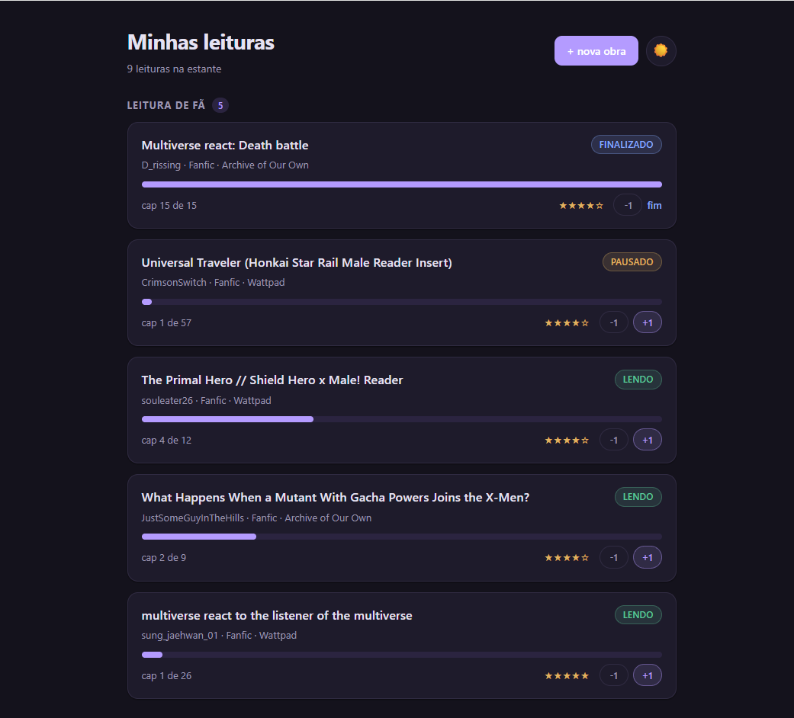
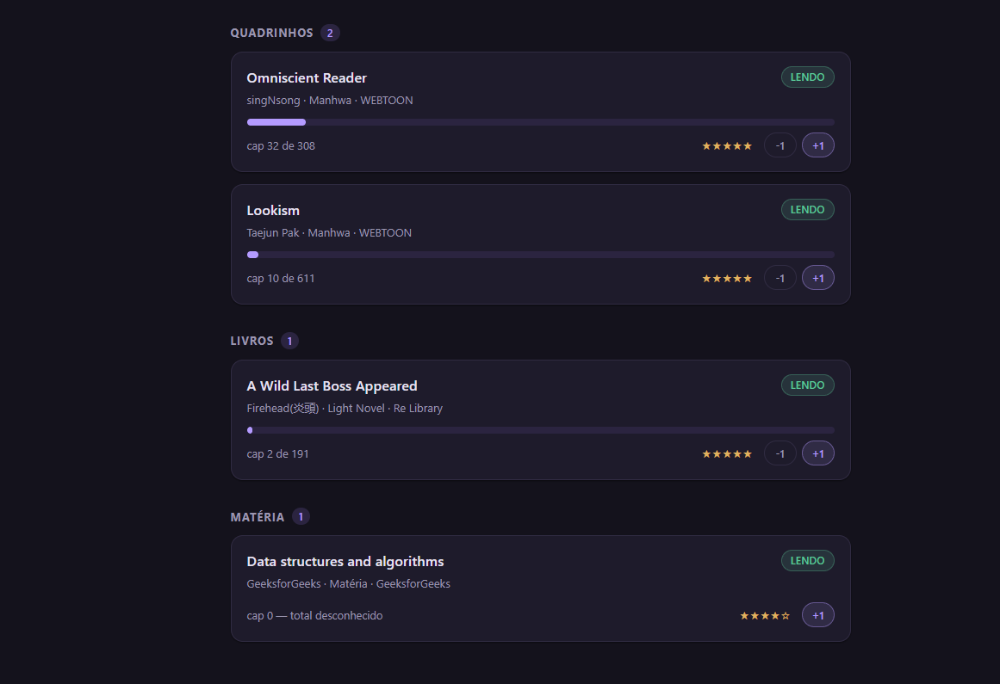

# Rastreador de Leitura

API REST em Django + DRF pra acompanhar o que estou lendo — fanfic, mangá,
manhwa, webtoon, HQ, light novel e até matéria da faculdade — com uma estante
web que separa por grupo e marca capítulo sem abrir o admin.

Construído porque o Wattpad deixa votar, mas não deixa guardar nota própria,
nem separar "pausado" de "abandonado", nem ver tudo que leio em vários sites
numa lista só. Uso todo dia.





*O topo da estante e o resto da rolagem. Cada seção sai do tipo da obra — não
existe campo `grupo` no banco.*

## O que faz

- **Estante** (`/`) — cards com selo de status, barra de progresso, título
  clicável pro site original e nota em estrelas.
- **Estante separada por grupo** — leitura de fã, quadrinhos, livros e matéria.
  O grupo é deduzido do tipo da obra, não é campo no banco.
- **Cadastro numa tela só** (`/obras/nova/`) — obra e leitura no mesmo POST,
  dentro de uma transação: capítulo inválido não deixa obra órfã no banco.
- **Botões `+1` / `-1`** direto no card: marca o capítulo sem sair da página.
- **Status que se corrige sozinho** — chegou no último capítulo vira
  `Finalizado` e grava a data; voltou atrás, volta pra `Lendo`.
- **Tema claro/escuro**, guardado no navegador.
- **API REST** completa (CRUD) em `/api/`.
- **Admin** do Django pra cadastro em massa.

## Stack

Python · Django 5.2 · Django REST Framework · SQLite · HTML/CSS/JS sem framework

## Como rodar

```bash
git clone https://github.com/gabrielbastosg/rastreador-leitura.git
cd rastreador-leitura
python -m venv .venv
.venv\Scripts\activate        # Linux/macOS: source .venv/bin/activate
pip install -r requirements.txt
copy .env.example .env         # Linux/macOS: cp .env.example .env
python manage.py migrate
python manage.py createsuperuser
python manage.py runserver
```

Abre `http://127.0.0.1:8000/`. A estante começa vazia — cadastre a primeira
obra em `/obras/nova/`.

O `.env` guarda a `SECRET_KEY` e o `DEBUG`, lidos com `python-decouple`.
Nunca vai pro Git — o modelo está no `.env.example`.

## Rotas web

| Rota | O que faz |
|---|---|
| `/` | estante — cards agrupados, `+1`/`-1`, tema claro/escuro |
| `/obras/nova/` | cadastro de obra + leitura |
| `/admin/` | admin do Django |

## API

| Método | Rota | O que faz |
|---|---|---|
| `GET` `POST` | `/api/obras/` | lista e cadastra obras |
| `GET` `PUT` `PATCH` `DELETE` | `/api/obras/{id}/` | uma obra |
| `GET` `POST` | `/api/leituras/` | lista e cadastra leituras |
| `GET` `PUT` `PATCH` `DELETE` | `/api/leituras/{id}/` | uma leitura |

Dois `ModelViewSet` registrados num `DefaultRouter`, então a API navegável do
DRF responde no navegador em `/api/`.

`GET /api/leituras/` devolve `obra_titulo` junto, via `source='obra.titulo'`,
pra não precisar de uma segunda chamada só pelo nome da obra.

## Modelo de dados

**Obra** — `tipo` (Fanfic/Mangá/Manhwa/Webtoon/HQ/Light Novel/Matéria),
`titulo`, `autor`, `plataforma`, `link` (único, opcional),
`total_capitulos` (opcional).

**Leitura** — FK pra `Obra`, `capitulo_atual`, `status`
(Lendo/Pausado/Finalizado/Abandonado), `nota` de 1 a 5, `criado_em`,
`atualizado_em`, `encerrado_em`.

Obra e leitura são separadas porque a mesma obra pode ser relida.
`total_capitulos` aceita nulo: fanfic em andamento não tem total. `link` também:
matéria da faculdade é PDF, não tem URL.

## Decisões que valem explicar

**A regra de validação mora num lugar só.** `Leitura.clean()` barra
`capitulo_atual` maior que o total da obra. O DRF **não** chama `full_clean()`
sozinho, então `LeituraSerializer.validate()` monta uma `Leitura` e chama o
mesmo `clean()` — em vez de reescrever a regra em dois lugares e um dos dois
ficar pra trás.

**O status só muda no par que o app tem certeza.** Chegou no total →
`Finalizado`. Saiu do total estando `Finalizado` → `Lendo`. `Pausado` e
`Abandonado` nunca são tocados automaticamente: a diferença entre os dois é
decisão do leitor, não dá pra deduzir do número do capítulo.

**Os botões usam POST, não GET.** Um `<form>` com ``,
`@require_POST` na view e redirect depois de salvar — mudança de estado por
link seria disparada por qualquer prefetch do navegador, e o F5 repetiria a
ação.

**O intervalo é conferido no servidor.** `save()` não chama `clean()`, então a
view valida o capítulo antes de gravar em vez de confiar no botão.

**As estrelas são uma `@property` no modelo.** Template do Django não faz laço
com contador nem aritmética; a nota vira `★★★★☆` em Python.

**O grupo da estante não é campo no banco.** Ele sai de um dicionário
`{tipo: grupo}` no modelo, exposto por uma `@property`. Guardar os dois seria
convidar os dois a discordarem — uma obra marcada `Manhwa` com grupo `Matéria`,
e nenhum jeito de saber qual está certo. A ordem das seções na tela também vem
desse dicionário, então não existe uma segunda lista pra ficar pra trás.

## Próximos passos

- Filtros na API com `django-filter` (status, tipo, plataforma)
- Autenticação — hoje a API é aberta, é projeto de uso local
- Testes automatizados
- Filtro por grupo na estante, quando a lista crescer
